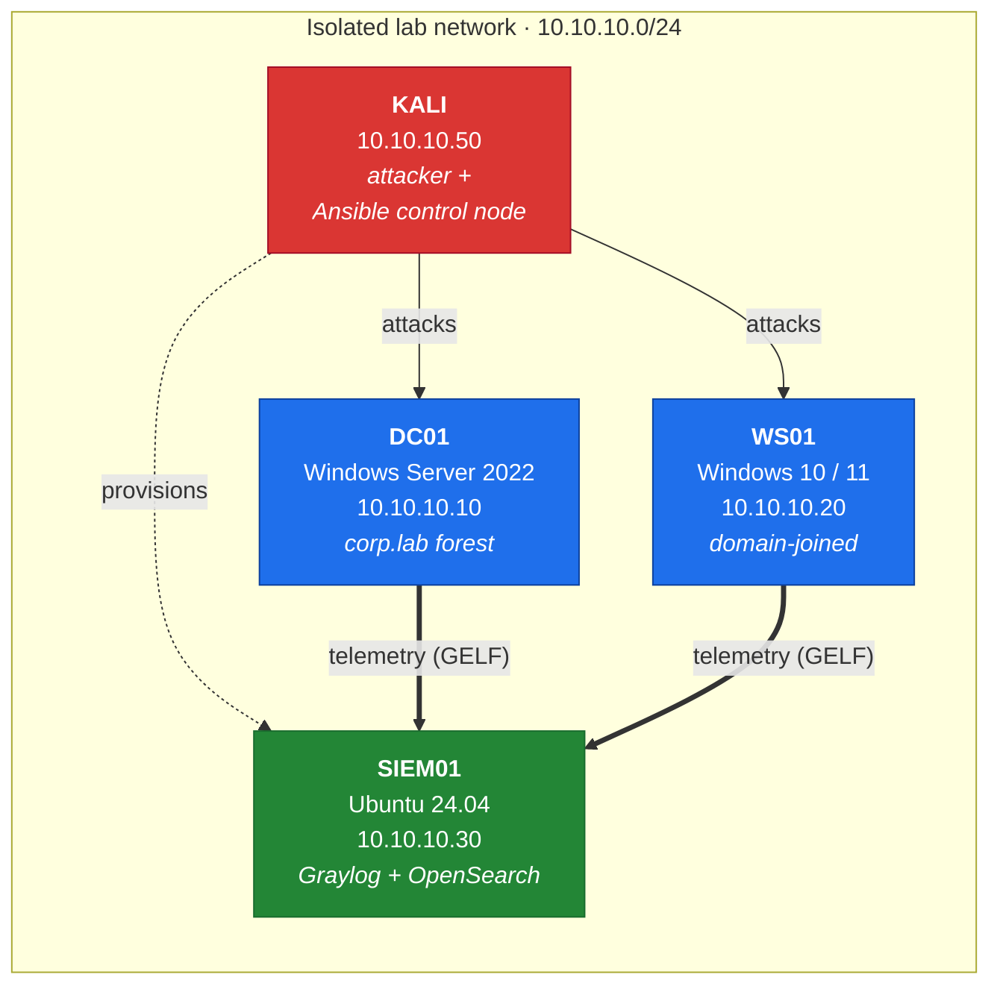
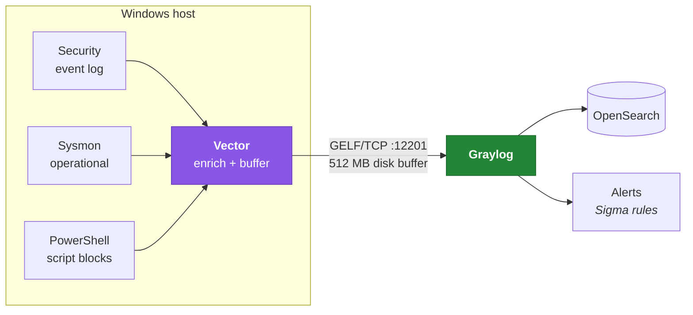
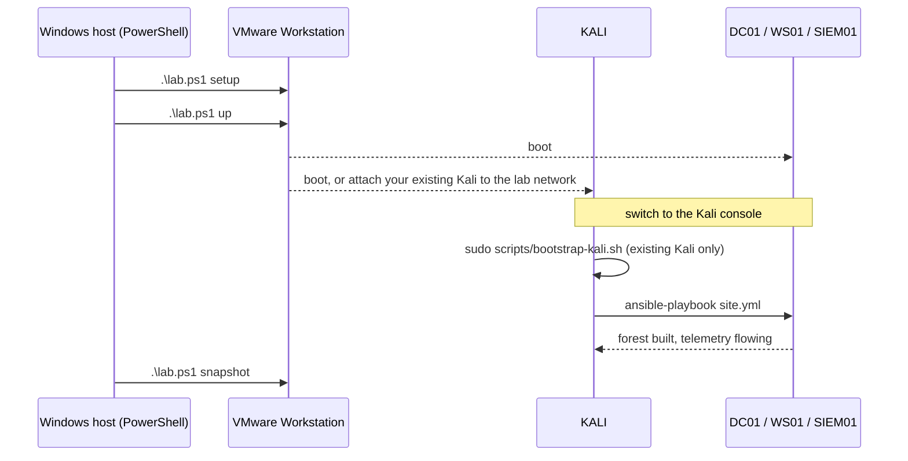

<h1 align="center">PurpleForest</h1>

<p align="center">
  <em>An Active Directory lab that fights back — and records everything.</em>
</p>

<p align="center">
  <a href="#quick-start">Quick start</a> ·
  <a href="docs/architecture.md">Architecture</a> ·
  <a href="docs/exercises.md">Exercises</a> ·
  <a href="docs/troubleshooting.md">Troubleshooting</a>
</p>

---

## Why this exists

Most AD labs teach you one half of the job.

Offensive labs hand you a deliberately broken domain and a list of attacks.
You run Rubeus, you get a hash, you move on — and you learn nothing about
what the defender saw. Detection labs go the other way: a SIEM full of
sample data, and rules you never watched fire against a real attack.

The gap between them is where the actual work lives. A detection engineer
who has never run the attack writes brittle rules. A red teamer who has
never read the telemetry doesn't know which of their choices were loud.

**PurpleForest builds both sides in one place.** Four VMs, fully automated:
a Windows domain with realistic misconfigurations, full telemetry collection
through Vector, and Graylog to detect what you just did. Every exercise
follows the same arc — run the attack, find it in the logs, write the rule,
watch it fire, then work out how to evade it.

It's the lab behind the exercise series at [noob2root.com](https://noob2root.com).
You don't need the blog to use it, but the posts walk through each exercise
in detail.

### What makes it different

- **Attack and detection in one loop.** Not a target range, not a SIEM demo.
- **Toggleable misconfigurations.** The domain builds *clean*. Each exercise
  enables only the flaw it needs, so you're never attacking a domain that's
  broken in twelve ways at once.
- **Audit policy handled.** Windows doesn't log most of what AD detections
  need, out of the box. That's the single biggest reason home-lab detections
  silently never fire — so it's automated here rather than left in a README
  for you to skim past.
- **Vector, not agent sprawl.** One collector, one config language, fanning
  out wherever you point it. The same pattern real security data pipelines
  are moving toward.
- **Reproducible.** `vagrant destroy && vagrant up` returns you to a known
  state. Snapshot discipline is built into the tooling.

---

## Topology



The Windows hosts have **no internet route**. Responder and ntlmrelayx on a
real network are a genuinely bad afternoon.

## Telemetry pipeline



Vector's disk buffer means the SIEM can go down mid-attack without losing
events — which is itself worth demonstrating once.

---

## Requirements

| | |
|---|---|
| Host RAM | 32 GB recommended · 24 GB workable |
| Disk | ~150 GB free |
| Hypervisor | VMware Workstation Pro (free for personal use) |
| Vagrant | 2.4+ with `vagrant plugin install vagrant-vmware-desktop` (free, MPL) |
| Also | Vagrant VMware Utility — a separate system installer from the plugin |

**No OS images ship with this repo.** Vagrant pulls public boxes from the
registry at build time. The Windows boxes are Microsoft *evaluation* builds
(180 days for Server, 90 for the client). Complying with that licensing is
your responsibility.

Ansible is **not** a host prerequisite — it installs into the Kali VM, which
is where you run it from.

---

## Quick start

Everything below runs on the **Windows host** — the machine running VMware
Workstation — not inside a VM.

**1. Install VMware Workstation Pro** (free for personal use). It sits behind
a Broadcom login, so it's the one thing the script can't fetch for you.

**2. Run setup** from an *Administrator* PowerShell:

```powershell
Set-ExecutionPolicy -Scope Process Bypass -Force
irm https://raw.githubusercontent.com/zebracherry/PurpleForest/main/lab.ps1 -OutFile lab.ps1
Unblock-File .\lab.ps1       # clears the downloaded-from-internet mark
.\lab.ps1 setup
```

Setup asks two questions, then does the rest:

- **Which drive?** VMs, Vagrant boxes (~40 GB) and snapshots all land there,
  not on `C:`. Budget ~150 GB.
- **Already have a Kali VM?** Say yes and point it at the `.vmx`; the lab
  attaches it to the lab network instead of downloading another one.

It then installs Vagrant, the Vagrant VMware Utility (both checksum-verified
against HashiCorp's published SHA256SUMS) and the `vagrant-vmware-desktop`
plugin, skipping anything already present. Re-running it is safe.

**3. Bring the VMs up** from the lab folder setup created:

```powershell
cd D:\PurpleForest        # whichever drive you picked
.\lab.ps1 up              # ~30-60 min, mostly downloads
```

**4. Provision from inside Kali:**

```bash
git clone https://github.com/zebracherry/PurpleForest.git ~/PurpleForest
sudo ~/PurpleForest/scripts/bootstrap-kali.sh    # only if you brought your own Kali
cd ~/PurpleForest/ansible
ansible-playbook site.yml                        # ~30-40 min
```

**5. Snapshot** back on the host, before attacking anything:

```powershell
.\lab.ps1 snapshot
```

### Why two machines?

Vagrant drives VMware Workstation directly, so it has to run on the **Windows
host** — a guest can't create sibling VMs. Ansible has no supported Windows
control node, so it runs from **Kali**, which is already on the lab network.
Two places, one honest boundary: `lab.ps1` on the host builds and snapshots
the VMs, Ansible in Kali configures them.



On a Linux host, swap `.\lab.ps1` for `./lab.sh` (which has no `setup` —
install Vagrant and the utility with your package manager first).

---

## Choosing the workstation OS

Windows 10 is the default — it boots with no firmware prerequisites.

```powershell
$env:LAB_WS_OS = 'win11'; .\lab.ps1 up ws01    # opt into Windows 11
```

Windows 11 needs TPM 2.0 and Secure Boot, and attaching the vTPM forces
VMware to encrypt the VM, which breaks `vagrant snapshot`. Read
[docs/windows-11.md](docs/windows-11.md) first. Nothing in the exercise
series depends on your choice.

---

## Running an exercise

The domain builds clean. Each exercise enables the one flaw it needs:

```bash
ansible-playbook site.yml -e misconfig_kerberoast=true
```

| Flag | Exercise |
|---|---|
| `misconfig_kerberoast` | Kerberoasting |
| `misconfig_asreproast` | AS-REP roasting |
| `misconfig_weak_spray_target` | Password spraying |
| `misconfig_password_in_desc` | Credentials in AD attributes |
| `misconfig_acl_genericall` | ACL abuse |
| `misconfig_unconstrained_deleg` | Delegation abuse |
| `misconfig_smb_signing_off` | NTLM relay |

Each post is tagged in git (`v1-kerberoasting`, `v2-asreproast`, …) so you
can check out the exact lab state a given write-up describes.

See [docs/exercises.md](docs/exercises.md) for the full roadmap — AD first,
then LOLbins, Linux, Entra ID, AWS, and Kubernetes.

---

## Access

| Thing | Where | Credentials |
|---|---|---|
| Graylog | http://10.10.10.30:9000 | `admin` / see `ansible/group_vars/all.yml` |
| Domain | `corp.lab` | `CORP\Administrator` / see group_vars |
| Any VM | — | `vagrant` / `vagrant` |

Passwords are deliberately weak — several exercises depend on weak
credentials existing. Change them in `group_vars/all.yml` if you like, but
never expose this lab to a network you value.

---

## Repo layout

```
purpleforest/
├── Vagrantfile              4 VMs: NICs, RAM, disk, OS selection
├── lab.ps1                  Windows host: setup / check / up / snapshot / restore / destroy
├── lab.sh                   Linux host equivalent
├── ansible/
│   ├── site.yml             ordered plays — SIEM, DC, workstation, telemetry
│   ├── group_vars/all.yml   domain config + misconfiguration toggles
│   └── roles/
│       ├── common_win/      firewall, Defender, timezone
│       ├── dc/              forest, BadBlood, misconfigs, audit policy
│       ├── workstation/     domain join, local audit policy
│       ├── telemetry/       Sysmon + Vector
│       └── graylog/         Docker stack, GELF input
├── detections/              Sigma rules, one folder per exercise
├── docs/                    architecture, exercises, troubleshooting
└── scripts/                 Kali control-node bootstrap
```

---

## Contributing

Exercise contributions are very welcome — see
[CONTRIBUTING.md](CONTRIBUTING.md). The short version: an exercise isn't
finished until the detection fires *and* you've written down how to evade it.

## Licence

[MIT](LICENSE) for the code here. The operating systems it downloads are
licensed by their respective vendors.

## Credits

Standing on the shoulders of
[GOAD](https://github.com/Orange-Cyberdefense/GOAD),
[BadBlood](https://github.com/davidprowe/BadBlood),
[sysmon-modular](https://github.com/olafhartong/sysmon-modular),
and the Vagrant box maintainers who keep Windows images current.
