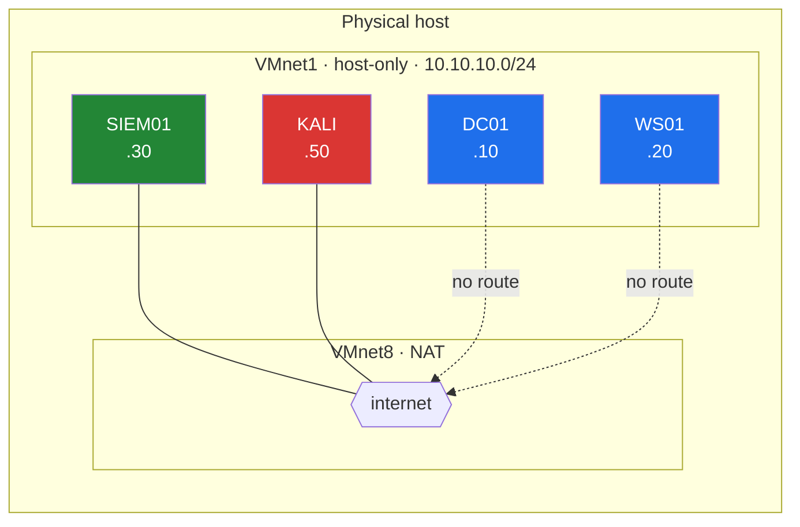
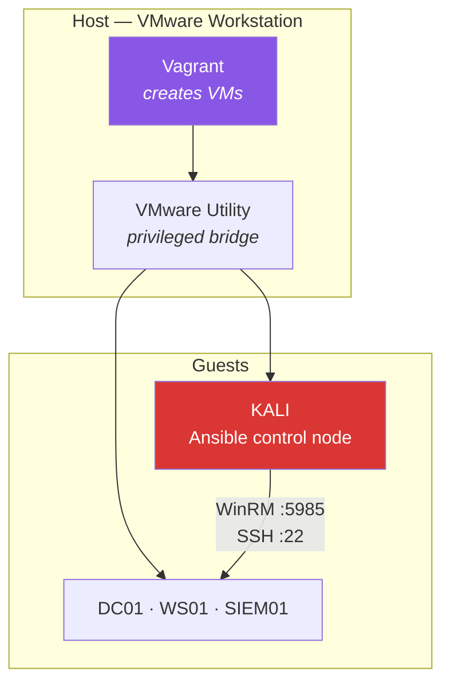
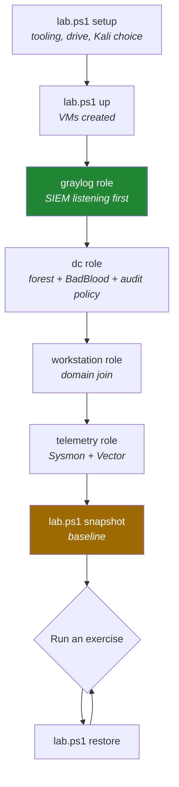

# Architecture

Why the lab is shaped the way it is, and what each piece is doing.

---

## Hosts

| VM | OS | vCPU | RAM | Disk | Role |
|---|---|---|---|---|---|
| `DC01` | Windows Server 2022 (eval) | 2 | 4 GB | 60 GB | Domain controller for `corp.lab` |
| `WS01` | Windows 10 or 11 (eval) | 2 | 4 GB | 60 GB | Domain-joined foothold |
| `SIEM01` | Ubuntu 24.04 LTS | 4 | 8 GB | 200 GB | Graylog, OpenSearch, MongoDB |
| `KALI` | Kali rolling | 2 | 4 GB | 60 GB | Attacker + Ansible control node |

About 20 GB of RAM with everything running. On a 32 GB host that leaves
comfortable headroom; on 24 GB it's tight but workable. Below that, drop
`WS01` and attack the DC directly — you lose lateral movement scenarios but
keep most of the AD content.

---

## Network

`SIEM01` and `KALI` get a second NAT adapter so Docker images and tool
updates can download. The Windows hosts stay isolated on purpose — poisoning
and relay exercises leak onto whatever network they can reach.

DNS inside the lab points at `DC01`. This is not optional: the domain join
fails with an unhelpful error if `WS01` resolves through anything else.

---

## Control plane

The split between host and guest is the part people trip over.

**Vagrant must run on the host.** It talks to Workstation through the VMware
Utility, a privileged local service. A guest VM cannot create sibling VMs in
its own hypervisor.

**Ansible must run from Kali.** Ansible has no supported Windows control
node, and Kali is already on the lab network with the right routes. Running
it from WSL would work too, but then you need a second network path into the
lab, which is one more thing to get wrong.

---

## Build sequence

Order matters. Each stage depends on the last.

The SIEM comes up first so there's somewhere for telemetry to land the
moment Vector starts. Building it last means your first events vanish into a
closed port and you spend an hour debugging Vector instead.

---

## Telemetry

### What's collected

| Source | Channel | Why |
|---|---|---|
| Security | `Security` | 4624/4625 logons, 4768/4769 Kerberos, 4662 DS access, 4688 process creation |
| Sysmon | `Microsoft-Windows-Sysmon/Operational` | Event 1 process creation with hashes, 10 LSASS access, 22 DNS |
| PowerShell | `…/PowerShell/Operational`, `Windows PowerShell` | Script block logging, 4104 |
| System | `System` | Service installs, driver loads |

### Audit policy is the hidden dependency

Windows ships with most of this **off**. Without the `auditpol` block in the
`dc` role, roughly half the exercises produce no telemetry at all and you'll
spend an afternoon blaming Vector. Specifically:

- Kerberos Service Ticket Operations — no 4769, so no Kerberoasting detection
- Kerberos Authentication Service — no 4768, so no AS-REP roasting detection
- Directory Service Access — no 4662, so no DCSync detection
- Process Creation *with command line* — 4688 without the command line is
  close to useless for LOLbin detection

This is automated deliberately rather than documented, because it's the
thing everyone skips.

### Why Vector

One agent, one config language, and it fans out to as many destinations as
you want. The disk buffer is the part that matters for a lab: kill Graylog
mid-attack, bring it back, and the events replay. That's worth demonstrating
once as its own exercise.

The `remap` transform tags every event with the host, its role, and the
domain before shipping, so Graylog searches can scope by role without
parsing hostnames.

> **Version caveat.** Vector's Windows event log source has been renamed
> across releases. Run `vector list` on the guest and reconcile with
> `ansible/roles/telemetry/templates/vector.yaml.j2` if nothing ships. The
> `vector validate` task in the telemetry role fails loudly rather than
> silently shipping nothing.

---

## Why Graylog

Three SIEMs were plausible:

| | Verdict |
|---|---|
| **Graylog Open** | Chosen. Real alerting for free, runs in ~4 GB, native GELF input, Sigma support. |
| Elastic Security | Best prebuilt AD detection rules and the nicest UI, but wants 8 GB+ before you've indexed anything. A good "migrate later" post. |
| Splunk Free | Tempting given how common it is at work, but the free licence has **no alerting and no authentication**. That disqualifies it for a detection lab. |

Sigma is the source of truth for rules in `detections/`, so the content stays
useful to readers running Elastic or Splunk instead.

---

## Design decisions worth knowing

**The domain builds clean.** Misconfigurations are off by default and enabled
per exercise. A domain broken in twelve ways at once makes it impossible to
tell which flaw your attack actually used, and the detection baseline is
meaningless.

**BadBlood runs by default.** Thousands of generated users, groups and ACLs.
It's slow (10–20 minutes) but it's the difference between BloodHound output
that looks like a real environment and one with five test accounts.

**Defender is off by default.** Realism versus first-run success — first-run
success wins. Flip `disable_defender: false` in `group_vars/all.yml` once
an exercise works, and re-run it to see what Defender catches. That
comparison is good content.

**Snapshots over rebuilds.** Restoring `baseline` takes seconds; rebuilding
the domain takes 40 minutes. Attack telemetry from a previous exercise
poisons the next one's baseline, so this isn't optional hygiene.
