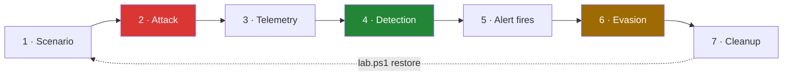

# Exercise roadmap

Every exercise follows the same seven-step arc. The format is deliberate:
running the attack without reading the telemetry teaches you half the job,
and writing the rule without trying to evade it teaches you a brittle one.

1. **Scenario** — what the attacker wants, where they sit in the kill chain
2. **Attack** — exact tooling and commands, reproducible
3. **Telemetry** — which Vector source, which event IDs, the raw event
4. **Detection** — the Sigma rule and the Graylog query, and why it works
5. **Alert** — the alert firing, with tuning notes and expected false positives
6. **Evasion** — how a real attacker dodges it, and what that costs them
7. **Cleanup** — snapshot rollback

Step 6 is the one most write-ups skip, and it's the one that makes the rest
worth reading.

---

## Track 1 — Active Directory

The core series.

| # | Exercise | Toggle | Tooling | Key telemetry |
|---|---|---|---|---|
| 1 | Domain enumeration | — | ADReaper, SharpHound, `ldapsearch` | 4662, LDAP query volume |
| 2 | AS-REP roasting | `misconfig_asreproast` | Rubeus, `GetNPUsers.py` | 4768 (enc type 23) |
| 3 | Kerberoasting | `misconfig_kerberoast` | Rubeus, `GetUserSPNs.py` | 4769 (RC4 requests) |
| 4 | Password spraying | `misconfig_weak_spray_target` | Kerbrute, DomainPasswordSpray | 4625 volume, 4771 |
| 5 | Credentials in AD attributes | `misconfig_password_in_desc` | PowerView, `ldapsearch` | 4662 read patterns |
| 6 | LLMNR/NBT-NS poisoning | `misconfig_smb_signing_off` | Responder, `ntlmrelayx` | Sysmon 22, 4624 type 3 |
| 7 | Credential dumping | — | Mimikatz, `comsvcs.dll`, procdump | Sysmon 10 (LSASS access), 4688 |
| 8 | Pass-the-Hash / Pass-the-Ticket | — | impacket, Rubeus | 4624 type 3/9, 4768 anomalies |
| 9 | ACL abuse (`GenericAll`) | `misconfig_acl_genericall` | PowerView, BloodHound | 4662, 5136 |
| 10 | Delegation abuse | `misconfig_unconstrained_deleg` | Rubeus, `getST.py` | 4769 delegation flags |
| 11 | DCSync | — | `lsadump::dcsync` | 4662 with replication GUIDs |
| 12 | Golden / Silver tickets | — | Mimikatz, `ticketer.py` | 4769 anomalies, nonexistent accounts |
| 13 | Persistence | — | AdminSDHolder, SharpGPOAbuse | 5136, 4739, service installs |

---

## Track 2 — Living off the land

Same VMs, no new infrastructure. Good shorter posts between the heavier
tracks.

- `certutil`, `bitsadmin`, `curl.exe` — ingress tool transfer
- `rundll32`, `regsvr32`, `mshta` — proxy execution
- `wmic`, `schtasks`, `sc.exe` — execution and persistence
- `msbuild`, `installutil` — trusted developer utilities

Detection theme throughout: parent/child process anomalies and command-line
patterns. This is where 4688-with-command-line earns its place.

---

## Track 3 — Linux telemetry

Adds `WEB01` (Ubuntu or RHEL, 2 GB). Vector on Linux with `journald`, `file`
and auditd sources.

- Web app exploitation to reverse shell
- SUID and capability abuse, sudo misconfiguration
- Cron and systemd persistence
- Linux host domain-joined to `corp.lab` — cross-platform AD attacks

---

## Track 4 — Azure / Entra ID

A free developer tenant. No extra local VMs for most of it.

- Entra ID enumeration (ROADrecon, AADInternals)
- Device code phishing, token theft, primary refresh tokens
- Consent grant attacks, app registration abuse
- Hybrid identity: Entra Connect, Seamless SSO, PTA abuse

Telemetry: Entra sign-in and audit logs → Vector HTTP source → Graylog.

---

## Track 5 — AWS

Free tier, torn down after each exercise.

- IAM enumeration and privilege escalation paths (Pacu)
- S3 misconfiguration, IMDSv1 credential exposure
- Lambda and role-chaining abuse
- Persistence via access keys and trust policies

Telemetry: CloudTrail → S3 → Vector `aws_s3` source → Graylog.

---

## Track 6 — Kubernetes and OpenShift

Adds `K8S01` (6 GB) running k3s, with OpenShift via CRC later.

- Exposed API server and kubelet abuse
- RBAC escalation, service account token theft
- Container breakout: privileged pods, hostPath mounts
- Malicious admission controllers, cronjob persistence
- OpenShift specifics: SCCs, `oc` abuse, build pipeline compromise

Telemetry: Kubernetes audit log + Vector `kubernetes_logs` source.

---

## Publishing order

Infrastructure should be justified by the content that needs it, not built
up front.

1. **Vector in the lab** — build, config, one event end to end
2. **Graylog as the consumer** — introduced alongside exercise 1, so the SIEM
   arrives with real attack telemetry rather than in the abstract
3. **Exercises 2 onward** — one post each, following the seven-step arc
4. LOLbin posts interleaved when a longer track needs a break

---

## Contributing an exercise

See [CONTRIBUTING.md](../CONTRIBUTING.md). An exercise is complete when:

- the attack is reproducible from the commands as written
- the detection fires on a clean lab
- false positives and evasion are documented honestly
- the Sigma rule lives in `detections/<exercise>/sigma.yml`
